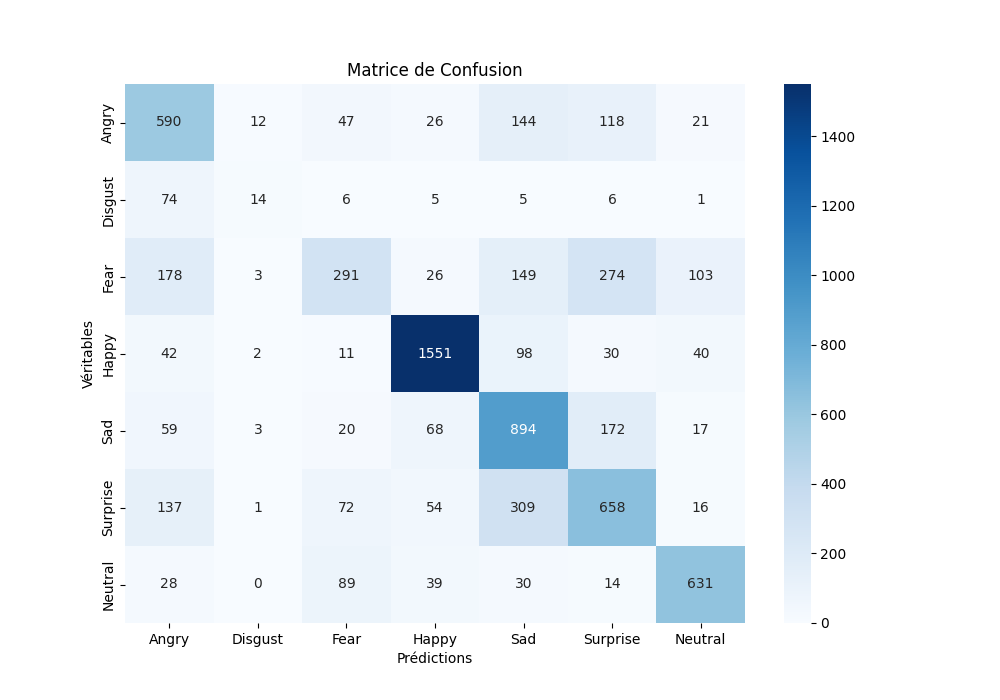

# Expression Recognition AI

## Description

Expression Recognition AI is a machine learning project designed to detect and classify facial expressions from images. Trained on the FER2013 dataset, this model relies on convolutional neural networks (CNN) to extract and learn facial features associated with different emotions.

## Dataset: FER2013

The FER2013 (Facial Expression Recognition 2013) dataset is a collection of 35,887 grayscale images of faces, each 48x48 pixels, categorized into seven classes:

- **Angry**
- **Disgust**
- **Fear**
- **Happy**
- **Neutral**
- **Sad**
- **Surprise**


## Model Architecture

We used a convolutional neural network (CNN) to process images and identify facial expressions. The model architecture includes:

- Multiple convolutional layers (`Conv2D`) with ReLU activation
- Pooling layers for dimensionality reduction
- Fully connected layers for classification
- A softmax layer to predict the corresponding emotion

## Results

The model was trained on the FER2013 training set and tested on the validation/test set. Here are some key results:

- **Test accuracy:** 64%
- **Confusion matrix:**



- **Example Predictions:**

| Input Image | Prediction |
|------------|------------|
|  | Happy |
|  | Sad |
|  | Angry |

## Installation

To run this project on your local machine, follow these steps:

```bash
# Clone the repository
git clone git@github.com:grem62/facial_expression.git
cd portfolio

# Install dependencies
pip install -r requirements.txt

# Train the model
python train_model4.py

# Run a prediction on a local image
python_test_model.py

# Run score class
python score_class.py
```

### Local Interface for Image Testing

To load and test a local image using a simple user interface, run:

```bash
streamlit run app.py
```

A web interface will open, allowing you to upload an image from your computer for prediction.

## Future Improvements

- Data augmentation to improve generalization
- Integration of a GAN model to generate images and balance the dataset
- Deployment of the model via an API or user interface
- Optimization of inference time for faster execution

## Author

- **Matheo Gremont** ([LinkedIn](https://www.linkedin.com/in/matheo-gremont-aa0b41251))
- Contact: gremontmatheo22@gmail.com

